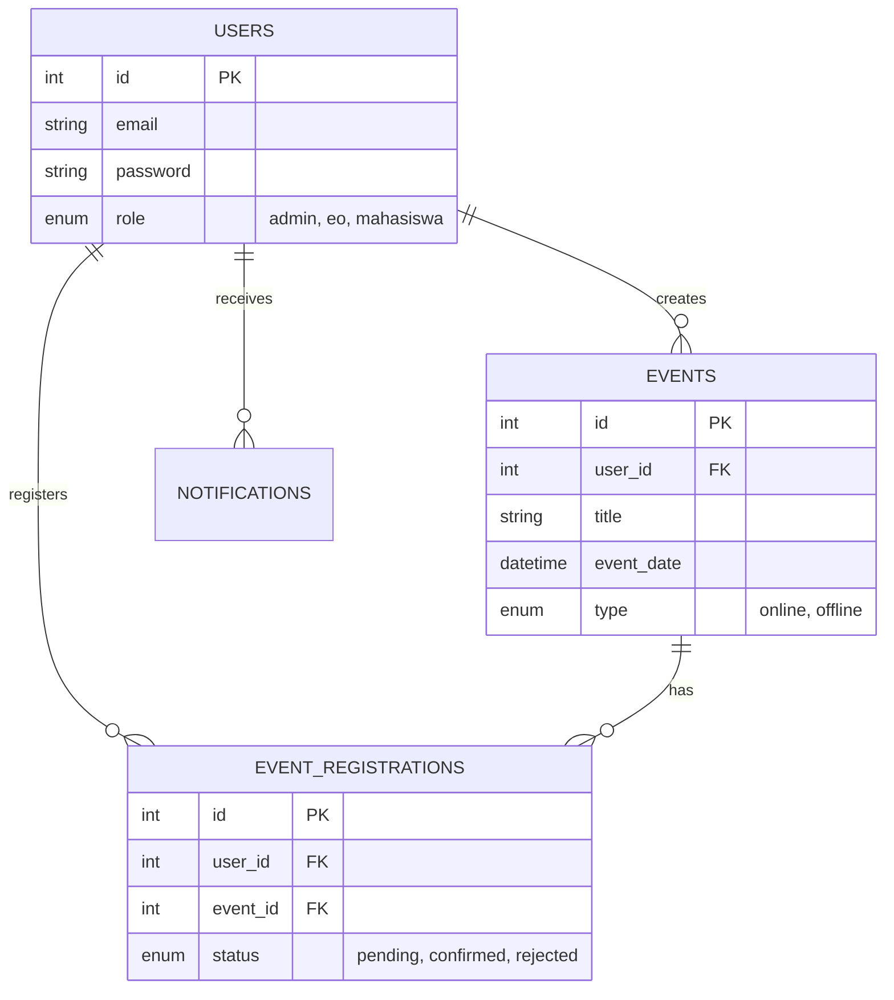

# Dokumentasi Arsitektur & Database

## 1. Diagram Arsitektur (High Level)

Aplikasi **EventKampus** dibangun menggunakan arsitektur **MVC-Light** (Model-View) dengan pola **OOP** untuk PHP Native.

```mermaid
graph TD
    User[Web Browser / Client] -->|HTTP Request| Server[Web Server (Apache/Nginx)]
    Server -->|Routing| Controllers[Page Logic / Controllers]
    
    subgraph "Application Layer (PHP)"
        Controllers -->|Uses| Auth[Auth Module]
        Controllers -->|Uses| EventMgr[Event Manager]
        Controllers -->|Uses| Analytics[Analytics Service]
        
        Auth -->|Validates| UserClass[Class: User]
        EventMgr -->|Manages| EventClass[Class: Event]
        Analytics -->|Calculates| AnalyticsClass[Class: AnalyticsService]
        
        UserClass --> DBWrapper[Class: Database (Singleton)]
        EventClass --> DBWrapper
        AnalyticsClass --> DBWrapper
    end
    
    subgraph "External Integration"
        Controllers -->|API Call| GoogleAPI[Google Calendar / Auth]
        Controllers -->|SMTP| MailServer[PHPMailer (Gmail SMTP)]
    end
    
    DBWrapper -->|MySQLi| DB[(MySQL Database)]
```

## 2. Struktur Direktori Utama

*   `/auth`: Menangani Login, Register, Logout, & Verifikasi OTP.
*   `/classes`: Kumpulan Class OOP (Model/Logic) -> `User.php`, `Event.php`, `Database.php`, `AnalyticsService.php`.
*   `/event_management`: Logika CRUD Event (Create, Edit, Delete).
*   `/pages`: Halaman View untuk User (Dashboard, Detail Event).
*   `/config`: Konfigurasi DB & Library Pihak Ketiga (Google Client, PHPMailer).

## 3. Entity Relationship Diagram (ERD - Konseptual)


